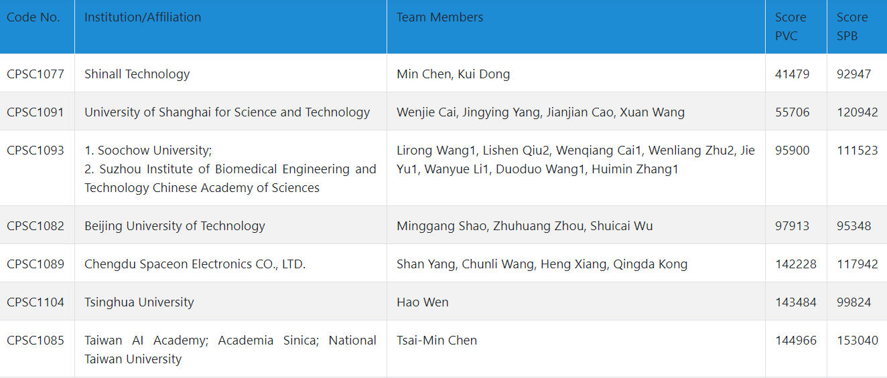

# CPSC2020
Searching for Premature Ventricular Contraction and Supraventricular Premature Beat from Long-term ECGs: The 3rd China Physiological Signal Challenge 2020

Update on 2020/12/31
--------------------

Evaluation result
-----------------
[Evaluation result](http://www.icbeb.org/CSPC2020) on the final full hidden test set
-----------

not fully listed

References:
-----------
[1] [ecg-classification](https://github.com/mondejar/ecg-classification)

[2] [BioSPPy](https://github.com/PIA-Group/BioSPPy)

[3] Cai, Wenjie, and Danqin Hu. "QRS complex detection using novel deep learning neural networks." IEEE Access (2020).

[4] [torch_ecg](https://github.com/wenh06/torch_ecg)

TODO:
-----
[1] more robust qrs detector (finished)

[2] feature engineering (deprecated)

[3] deep learning model structure design (ongoing)

[4] use SNR to deal with (eliminate?) too noisy segments?

[5] etc....

# NOTE

further updates will be done in [torch_ecg](https://github.com/wenh06/torch_ecg/tree/master/torch_ecg/train/train_crnn_cpsc2020), instead of this repository
