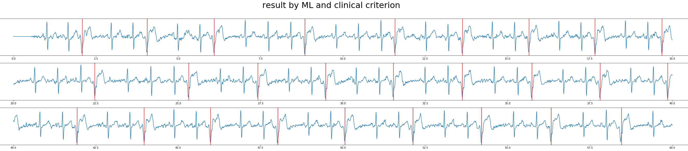
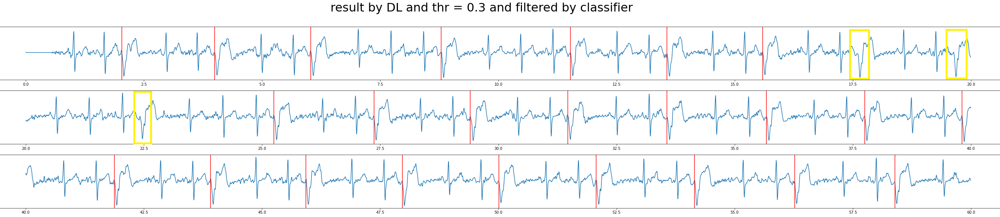
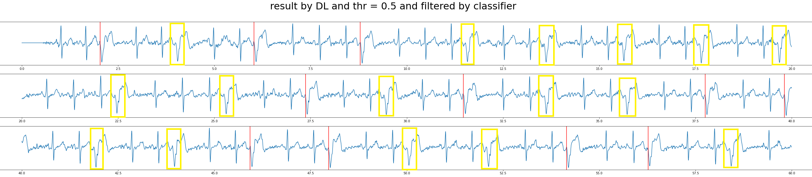

# CPSC2020

Searching for Premature Ventricular Contraction and Supraventricular Premature Beat from Long-term ECGs: The 3rd China Physiological Signal Challenge 2020

## Update on 2020/12/31

Click to view!

Tests are done on a 60s segment (median-filtered and bandpassed, `sample1_fs250.mat` in [this folder](sample_data/)) of a subject with frequent PVC.
* r peak detections are done using [this function](https://github.com/DeepPSP/cpsc2020/blob/master/signal_processing/ecg_rpeaks_dl.py#L33).
* PVC beats are labeled using red vertical lines.
* missed PVC beats are labeled using yellow boxes.

* the first image is the result by a <strong>modified version</strong> of machine learning algorithms from [this repo](https://github.com/mondejar/ecg-classification) using rr features and wavelet features, with post-processing using clinical rules. Note that [phase_one_legacy](phase_one_legacy/) is one such modified version, which uses XGBoost instead of SVM and without clinical post-processing.
* the second image is the result of the sequence labeling deep learning model with probability threshold 0.3, and filtered by a deep learning classifier. The missed PVC beats are caused by this classifier.
* the last image is the result of the sequence labeling deep learning model with probability threshold 0.5, and filtered by a deep learning classifier.

### Observations

* an effective and robust rpeak (qrs complex) detector is crucial.
* the sequence labeling deep learning model (trained only for a dozen epochs because of the approaching deadline) tends to make false positive predictions but seldom has false negatives; while the deep learning classifier (trained only for several hundred epochs) has few false positives but has slightly higher probability to have false negatives.
* given a good rpeak detector, machine learning models might well be competitive against deep learning models.
* changing the threshold of the sequence labeling deep learning model from 0.5 to 0.3 can largely reduce the PVCerr score (punishment); further removing the post-filtering of the deep learning classifier might further reduce the scores, raising more false positives while reducing false negatives, considering that false negative has punishment 5 times as the punishment of false positives.

## Challenge Results

Click to view!

<table class="table table-bordered table-striped">
	<tbody><tr style="background-color:#1e8cd5;"><td>Code No.</td><td>Institution/Affiliation</td><td>Team Members</td><td>Score PVC</td><td>Score SPB</td></tr>
	<tr><td>CPSC1077</td><td>Shinall Technology</td><td>Min Chen, Kui Dong</td><td>41479</td><td>92947</td></tr>
	<tr><td>CPSC1091</td><td>University of Shanghai for Science and Technology</td><td>Wenjie Cai, Jingying Yang, Jianjian Cao, Xuan Wang</td><td>55706</td><td>120942</td></tr>
	<tr>
		<td>CPSC1093</td>
		<td>
			1. Soochow University; 
			2. Suzhou Institute of Biomedical Engineering and Technology Chinese Academy of Sciences
		</td>
		<td>Lirong Wang1, Lishen Qiu2, Wenqiang Cai1, Wenliang Zhu2, Jie Yu1, Wanyue Li1, Duoduo Wang1, Huimin Zhang1 </td>
		<td>95900</td>
		<td>111523</td>
	</tr>
	<tr><td>CPSC1082</td><td>Beijing University of Technology</td><td>Minggang Shao, Zhuhuang Zhou, Shuicai Wu</td><td>97913</td><td>95348</td></tr>
	<tr><td>CPSC1089</td><td>Chengdu Spaceon Electronics CO., LTD.</td><td>Shan Yang, Chunli Wang, Heng Xiang, Qingda Kong </td><td>142228</td><td>117942</td></tr>
	<tr><td>CPSC1104</td><td>Tsinghua University</td><td>Hao Wen </td><td>143484</td><td>99824</td></tr>
	<tr><td>CPSC1085</td><td>Taiwan AI Academy; Academia Sinica; National Taiwan University</td><td>Tsai-Min Chen</td><td>144966</td><td>153040</td></tr>
	<tr><td>CPSC1098</td><td>Northeastern University</td><td>Yan Li, Yuxiang Li, Haixu Yang, Jihong Liu</td><td>151735</td><td>215664</td></tr>
	<tr><td>CPSC1092</td><td>Harbin Institute of Technology </td><td>Yang Liu, Runnan He</td><td>166215</td><td>160474</td></tr>
	<tr><td>CPSC1081</td><td>Institute of Semiconductors, Chinese Academy of Sciences; University of Chinese Academy of Sciences</td><td>Yibo Yin; Sitao Zhang</td><td>168578</td><td>195467</td></tr>
	<tr><td>CPSC1088</td><td>East China Jiaotong University</td><td>Feng Mei, Qian Hu, Lingfeng Liu</td><td>362348</td><td>120410</td></tr>
</tbody></table>

See the [official website](http://2020.icbeb.org/CSPC2020) for more details.

## References

1.  [ecg-classification](https://github.com/mondejar/ecg-classification)
2.  [BioSPPy](https://github.com/PIA-Group/BioSPPy)
3.  Cai, Wenjie, and Danqin Hu. "QRS complex detection using novel deep learning neural networks." IEEE Access (2020).
4.  [torch_ecg](https://github.com/DeepPSP/torch_ecg)

## TODO

1. more robust qrs detector (finished)
2. feature engineering (deprecated)
3. deep learning model structure design (ongoing)
4. use SNR to deal with (eliminate?) too noisy segments?
5. etc....

## NOTE

1. further updates will be done in [torch_ecg](https://github.com/DeepPSP/torch_ecg/tree/master/torch_ecg/train/train_crnn_cpsc2020), instead of this repository
2. if you find [this function](https://github.com/DeepPSP/cpsc2020/blob/master/signal_processing/ecg_rpeaks_dl.py#L33) useful, please cite Reference 3.

## Citation

DOI: 10.1088/1361-6579/ac9451
